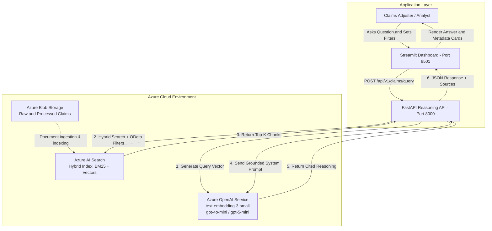

<div align="center">

# ClaimsInsight AI — Claims Reasoning Engine

### Enterprise-grade claims intelligence powered by Azure AI Foundry, Azure AI Search, and FastAPI

<p>
  Query complex motor vehicle accident and medical claims in natural language, retrieve multimodal claim documents using hybrid search, and generate strictly grounded, cited analytical assessments for claims adjusters and fraud investigation teams.
</p>

</div>

---

## Executive summary

**ClaimsInsight AI** is an end-to-end intelligent claims analysis platform designed to transform how insurance carriers, adjusters, and legal teams interact with multimodal claim files.

Processing modern insurance claims typically requires manually reconciling disjointed artifacts police collision reports, attending physician statements, physiotherapy progress logs, repair estimates, and policy schedules. ClaimsInsight AI eliminates this bottleneck by pairing **Azure AI Search hybrid retrieval (BM25 + Dense Vectors)** with **strict-citation Azure OpenAI RAG pipelines**.

Instead of manually cross-referencing hundreds of PDF pages across unstructured document lakes, users can submit questions such as:

> **What injuries were reported in claim CLM-2026-1045, and what was the discharge recovery timeline?**

or:

> **Summarize the physical therapy progress, VAS pain metrics, and treatment compliance for patient Allison Hill in CLM-2026-1000.**

The platform filters claims metadata, surfaces the top-ranked text and tabular chunks, strictly enforces document grounding to prevent hallucinations, and returns transparent answers complete with inline file citations (`filename`, `claim_id`, `page_number`, and similarity relevance scores).

The repository includes a complete production architecture: an ingestion and parsing pipeline, hybrid search vector indexing, a FastAPI REST API, a Streamlit claims reasoning explorer dashboard, automated test coverage, multi-container Docker configurations, Terraform Infrastructure-as-Code (IaC), and automated GitHub Actions CI/CD workflows.

---

## Contents

<table>
<tr>
<td width="33%">

**Product & business**
- [Current state & operational gap](#current-state)
- [Business problem](#business-problem)
- [Business requirements](#business-requirements)

</td>
<td width="33%">

**Architecture & engineering**
- [Solution architecture](#solution-architecture)
- [Hybrid search & retrieval](#hybrid-search--retrieval-mechanics)
- [Data safety & hallucination control](#data-safety--hallucination-control)
- [Project structure](#project-structure)

</td>
<td width="33%">

**Assurance & operations**
- [Testing approach](#testing-approach)
- [Containerization & Docker](#containerization--docker)
- [Infrastructure as Code (Terraform)](#infrastructure-as-code-terraform)
- [CI/CD & next steps](#cicd-pipeline--suggested-next-steps)

</td>
</tr>
</table>

---

# Current state

Traditional insurance claims processing workflows rely on distributed document repositories, manual reviews, and static keyword indexing.

Adjusters and claims analysts must read through raw PDFs, hand-written reports, and unstructured medical logs across disparate repositories. This slows settlement cycles, increases claim leakage, and heightens the risk of overlooked liability indicators or missed inconsistencies across injury reports.

### Current-state gap

<table>
<thead>
<tr>
<th>Operational Area</th>
<th>Current Claims Operations</th>
<th>ClaimsInsight AI Capability</th>
</tr>
</thead>
<tbody>
<tr>
<td><strong>Document discovery</strong></td>
<td>Adjusters manually browse storage buckets and open individual PDFs per claim folder.</td>
<td>Hybrid search discovers relevant passages across claims and document types instantly.</td>
</tr>
<tr>
<td><strong>Claim cross-referencing</strong></td>
<td>Correlating police statements against physiotherapy notes requires manual side-by-side reading.</td>
<td>Targeted metadata filtering and cross-claim semantic search reconcile statements in seconds.</td>
</tr>
<tr>
<td><strong>Information grounding</strong></td>
<td>Summary notes are written manually by adjusters without systematic document citations.</td>
<td>Every claim assertion requires inline attribution: <code>[Source: filename, Page: X, Claim: Y]</code>.</td>
</tr>
<tr>
<td><strong>Query interaction</strong></td>
<td>Rigid relational queries or manual filename searches.</td>
<td>Natural-language questions translated through embedding-guided RAG pipelines.</td>
</tr>
<tr>
<td><strong>Auditing & traceability</strong></td>
<td>Fragmented review logs with limited visibility into reasoning steps.</td>
<td>Deterministic chunk tracing, similarity scoring, and API response contracts.</td>
</tr>
</tbody>
</table>

---

# Business problem

Insurance carriers manage millions of unstructured claims records containing critical evidentiary data. When adjusters handle high claim volumes, cross-checking medical prognoses against police liability determinations becomes error-prone and slow.

ClaimsInsight AI resolves this challenge by providing an automated, grounded reasoning layer over indexed claims documents. 

The targeted business outcomes are:
- **Accelerated Claim Cycles:** Reduce initial file review time from hours to seconds.
- **Lower Claim Leakage:** Automatically detect medical timeline gaps and injury inconsistencies.
- **Strict Compliance & Grounding:** Prevent conversational hallucinations through bounded context retrieval and deterministic citation enforcement.

---

# Business requirements

<table>
<thead>
<tr>
<th>#</th>
<th>Requirement</th>
<th>Implementation & Scope</th>
</tr>
</thead>
<tbody>
<tr>
<td>1</td>
<td><strong>Natural-Language Claims Reasoning</strong></td>
<td>Users query claims using conversational business and insurance terminology.</td>
</tr>
<tr>
<td>2</td>
<td><strong>Hybrid Search Retrieval</strong></td>
<td>Combines lexical BM25 matching with dense vector embeddings (<code>text-embedding-3-small</code>).</td>
</tr>
<tr>
<td>3</td>
<td><strong>Strict Metadata Scoping</strong></td>
<td>Allows granular scoping by <code>claim_id</code> and <code>document_type</code> (e.g., <code>POLICE_REPORT</code>, <code>PHYSIO_NOTE</code>, <code>MEDICAL_DISCHARGE</code>, <code>POLICY_SCHEDULE</code>).</td>
</tr>
<tr>
<td>4</td>
<td><strong>Zero Hallucination Tolerance</strong></td>
<td>Responses must derive solely from provided documents; out-of-scope or missing files must yield an explicit refusal to speculate.</td>
</tr>
<tr>
<td>5</td>
<td><strong>Verifiable Attribution</strong></td>
<td>All extracted facts must provide bracketed file, page, and claim citations.</td>
</tr>
<tr>
<td>6</td>
<td><strong>Decoupled Microservice Architecture</strong></td>
<td>Production REST API (FastAPI) separated from the exploratory interface (Streamlit).</td>
</tr>
<tr>
<td>7</td>
<td><strong>Container Portability</strong></td>
<td>Dockerized deployments for cloud execution across Azure Container Apps and Kubernetes.</td>
</tr>
<tr>
<td>8</td>
<td><strong>Automated Quality Assurance</strong></td>
<td>Continuous integration runs linting, unit tests, and endpoint integration validation.</td>
</tr>
</tbody>
</table>

### Intended scope boundaries

The system should not:
- Speculate on claim liability or coverage when supporting records are missing.
- Alter source PDF files or execute unauthenticated updates against Azure Blob storage.
- Extrapolate medical diagnoses or prognosis outcomes beyond signed medical discharges or SOAP notes.
- Ingest sensitive claim data without strict identity and container-level boundary checks.

---

# Solution architecture




### Retrieval & reasoning sequence:

Request Intake: The API validates the query payload using Pydantic schemas (enforcing minimum query lengths and optional metadata filters).

Embedding Generation: Azure OpenAI converts the user query into high-dimensional embeddings using text-embedding-3-small.

Hybrid Search Execution: Azure AI Search executes simultaneous BM25 keyword matching and vector similarity calculations, applying Reciprocal Rank Fusion (RRF) alongside any active OData claim_id or document_type filters.

Context Construction: The top-$k$ retrieved chunks are formatted into structured XML context blocks containing explicit document source headers.

Grounded Synthesis: The reasoning LLM produces an evidence-backed summary with bracketed citations, explicitly declining to answer if retrieved chunks do not contain the answer.

Hybrid search & retrieval mechanics

Claims documents contain a mix of domain keywords (e.g., lumbar strain, ICD-10, subrogation, Unit 1) and conceptual context (e.g., collision impact mechanics, rehabilitation progress).

To ensure optimal recall, ClaimsInsight AI uses Reciprocal Rank Fusion (RRF):

$$RRF\_Score(d \in D) = \sum_{m \in M} \frac{1}{k + r_m(d)}$$

Lexical BM25: Accurately targets exact identifier lookups such as claim numbers, officer badge numbers, and specific statutory policy codes.

Dense Vector Search: Employs cosine distance over 1536-dimensional embeddings to capture conceptual nuance (e.g., mapping "severe neck pain" to "Grade II cervical spine whiplash").

Metadata Filters: Pre-filtering by claim_id restricts the candidate pool before scoring, preventing cross-claim data leakage.

Data safety & hallucination control

Claims reasoning requires strict accuracy safeguards. ClaimsInsight AI enforces safety through several programmatic controls:

Strict Retrieval Prompt Engineering: The system prompt prohibits external world knowledge. If the retrieved context is insufficient, the system must state: "I cannot find any information for claim ID [X] in the materials provided."

Source Attribution Parser: Every API response parses source chunks into structured payloads containing filename, claim_id, document_type, page_number, and search score.

Sanitized Request Validation: Pydantic models validate input strings, strip malicious characters, and block unprocessable requests with standardized HTTP 422 errors.

### Project structure

```text
claimsinsight-ai/
├── .github/
│   └── workflows/
│       ├── ci-cd.yml                # Automated testing, linting & index sync
│       ├── data-pipeline-ci.yml     # Ingestion pipeline validation
│       └── terraform-deploy.yml     # Azure infrastructure deployment
│
├── docker/
│   ├── .dockerignore                # Image build exclusion rules
│   ├── docker-compose.yml           # Multi-container orchestration (API + UI)
│   ├── Dockerfile.api               # FastAPI container specification
│   ├── Dockerfile.pipeline          # Ingestion batch processing container
│   ├── Dockerfile.ui                # Streamlit dashboard container
│   └── entrypoint.sh                # Container startup handler
│
├── infra/
│   └── terraform/
│       ├── main.tf                  # Azure resources (RG, Search, OpenAI, Storage)
│       ├── variables.tf             # Configurable deployment inputs
│       ├── outputs.tf               # Connection strings, keys, endpoints
│       └── terraform.tfvars         # Environment-specific variable overrides
│
├── src/
│   ├── api/
│   │   ├── main.py                  # FastAPI service, routers, CORS & lifespans
│   │   └── schemas.py               # Pydantic request/response data contracts
│   │
│   ├── rag/
│   │   ├── generator.py             # Context formatting, Azure OpenAI synthesis
│   │   └── retriever.py             # Hybrid Azure AI Search integration
│   │
│   ├── ui/
│   │   └── app.py                   # Interactive Streamlit claims dashboard
│   │
│   └── utils/
│       └── config.py                # Configuration and environment validation
│
├── tests/
│   ├── test_api.py                  # FastAPI integration & validation test suite
│   ├── test_parsing_logic.py        # Metadata parsing and text cleaning tests
│   └── test_retriever.py            # Context synthesis and search unit tests
│
├── scripts/
│   └── run_search_indexing.py       # Ingestion script to build Azure Search index
│
├── requirements.txt                 # Application runtime dependencies
├── requirements-pipeline.txt        # Data pipeline dependencies
└── README.md                        # Project documentation
```


### Technology stack

#### Local development

##### 1. Environment Setup

Clone the repository and create an isolated Python 3.12 virtual environment:

```powershell
git clone https://github.com/maraperera/claimsinsight-ai.git
cd claimsinsight-ai

python -m venv venv
.\venv\Scripts\Activate.ps1
pip install --upgrade pip
pip install -r requirements.txt
```

##### 2. Configure Environment Variables

Create a `.env` file in the project root:

```ini
# Azure OpenAI / Foundry
AZURE_OPENAI_ENDPOINT=your-azure-openai-endpoint
AZURE_OPENAI_API_KEY=your-azure-openai-key
AZURE_OPENAI_API_VERSION=2024-06-01
AZURE_OPENAI_CHAT_DEPLOYMENT=gpt-4o-mini
AZURE_OPENAI_EMBEDDING_DEPLOYMENT=text-embedding-3-small

# Azure AI Search
AZURE_SEARCH_ENDPOINT=your-azure-search-endpoint
AZURE_SEARCH_ADMIN_KEY=your-azure-search-key
AZURE_SEARCH_INDEX=claims-hybrid-index

# Storage Account
AZURE_STORAGE_ACCOUNT_NAME=stclaimsinsightprod
AZURE_STORAGE_ACCOUNT_KEY=your-storage-key
```

##### 3. Run the Services Locally

Open two terminal sessions:

**Terminal 1 — FastAPI Backend:**

```powershell
uvicorn src.api.main:app --reload --port 8000
```

* **Interactive Swagger Docs:** [http://127.0.0.1:8000/docs](http://127.0.0.1:8000/docs)
* **Health Check Endpoint:** [http://127.0.0.1:8000/health](http://127.0.0.1:8000/health)

**Terminal 2 — Streamlit Interface:**

```powershell
streamlit run src/ui/app.py
```

* **Dashboard URL:** [http://localhost:8501](http://localhost:8501)

---

### Testing approach

ClaimsInsight AI uses `pytest` with dependency overrides and mocks to run deterministic tests without invoking external Azure endpoints or running up cloud costs.

```powershell
pytest -v --cov=src --cov-report=term-missing
```

---

### Containerization & Docker

To run the complete architecture using Docker Compose without needing local Python runtimes:

```powershell
docker compose -f docker/docker-compose.yml up --build -d
```

To monitor running container logs:

```powershell
docker compose -f docker/docker-compose.yml logs -f
```

To tear down running services:

```powershell
docker compose -f docker/docker-compose.yml down
```

---

### Infrastructure as Code (Terraform)

All underlying Azure infrastructure can be provisioned reproducibly using the Terraform manifests in `infra/terraform/`:

```powershell
cd infra/terraform
terraform init
terraform plan -out=tfplan
terraform apply tfplan
```

**This provisions:**
* Azure Resource Group (`rg-claimsinsight-prod`)
* Standard Azure AI Search Service (`srch-claimsinsight-prod`)
* Azure Cognitive Account for OpenAI with auto-deployed embedding and reasoning models
* Azure Storage Account with `raw-claims` and `processed-claims` blob containers
* Log Analytics Workspace & Azure Container Apps Environment

---

### CI/CD pipeline & suggested next steps

The repository uses GitHub Actions (`.github/workflows/ci-cd.yml`) to automatically execute code quality checks, run unit and integration tests with coverage reporting, and synchronize Azure AI Search indexes on pushes to `main`.

---

### Summary

ClaimsInsight AI bridges the gap between unstructured claims evidence and claims reasoning.

By unifying hybrid retrieval, deterministic metadata filtering, verifiable citations, and automated containerization, the platform provides insurance engineering teams with a robust foundation for modern claims operations.